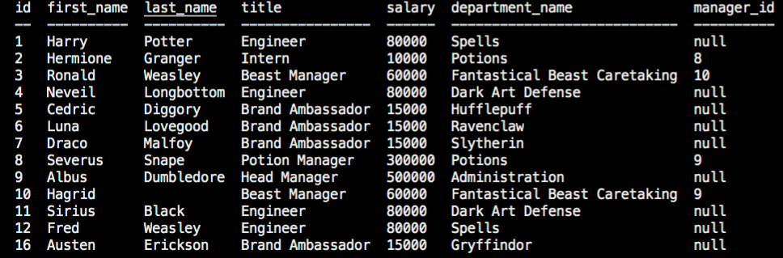

# employee-tracker
# Welcome to the employee-tracker
## Inside you will find:
* `instructions` folder containing assignment details
* `db` folder containing database schema and seeds as well as the database connection and an `index.html` file containing class constructor and methods
* `index.js` file containing code for assignment

 

*link to project repository* 

https://github.com/arerickson28/employee-tracker
 

 

*link to video walkthrough of app*  

https://drive.google.com/file/d/1fV94cAzbsyNRUsGN6g6PF_gefWUkfuMQ/view
 

 

*image of application*  

